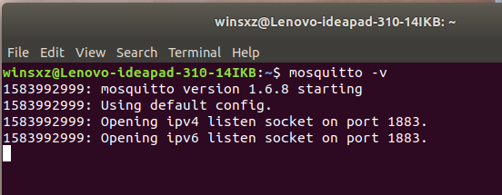
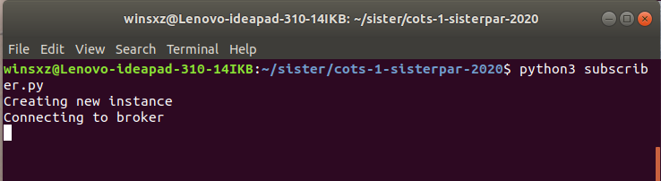
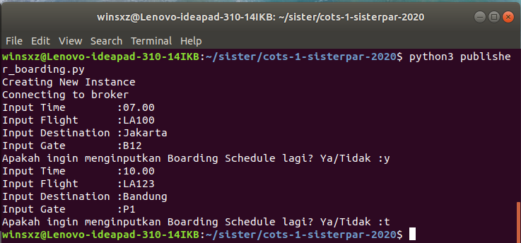
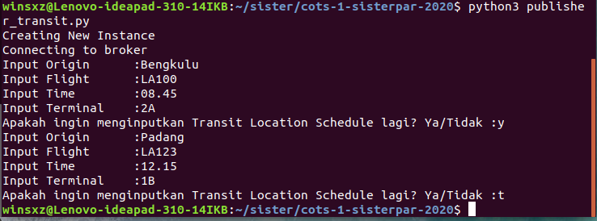
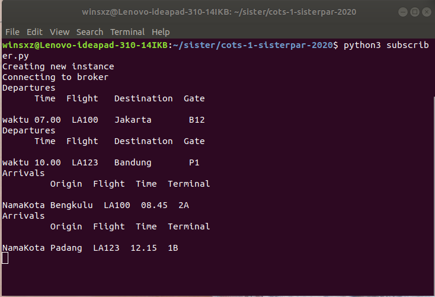
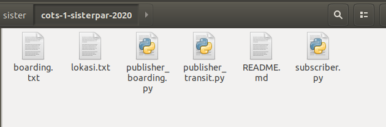
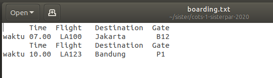
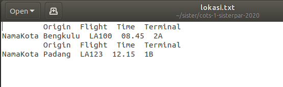

# a.  Deskripsi Aplikasi
Ini adalah program Notifikasi Jadwal Penerbangan Lion Air sederhana. Program ini menggunakan metode Publish-Subscribe.
Untuk development programnya kami menggunakan bahasa Pemrograman Python, beserta modulnya/library yang kami butuhkan seperti paho-mqtt, dan juga menggunakan Mosquitto-MQTT sebagai broker.

# b.  Tugas Anggota
Ihza Ghobah (Developer+Maintainer) 
Wino Rama Putra (Developer+Maintainer).

# c. Prosedur Instalasi
1.  Jalankan Broker/Mosquitto-MQTT. 
 
2.  Jalankan Program Subscribenya. 
 
3.  Jalankan Program Publishnya. 
Dibawah ini adalah running Publish Boarding dan melakukan Input Boarding. 
 
Dibawah ini adalah running Publish Transit dan melakukan Input Transit. 
 
4.  Ini adalah Hasil/Notifikasi yang kita peroleh. 
Dibawah ini adalah notifikasi yang ada di Subscribe. 
 
Dibawah ini adalah hasil dari Notifikasi tersebut, jika ada pesan berformat 'waktu', maka simpan pesan tersebut ke file boarding.txt. Jika pesan tersebut berformat 'NamaKota', maka simpan pesan tersebut ke dalam file lokasi.txt. 
 
Dibawah ini adalah isi dari file boarding.txt dan lokasi.txt, dimana isi filenya sama dengan pesan dari Publish. 
 
 
